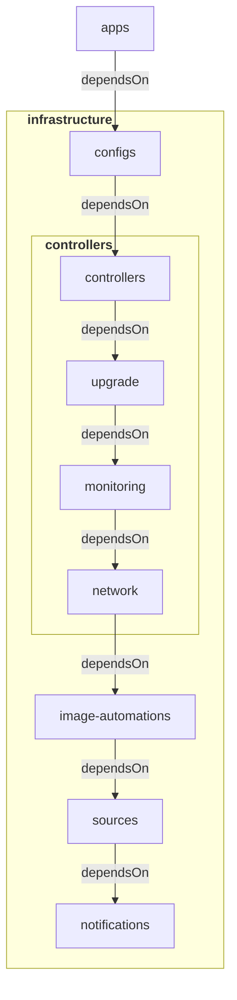

# (WIP) flux-template - An opinionated cluster agnostic Flux GitOps template repository

A lot of Flux template repositories expect you have already decided what type of Kubernetes distribution you want to use (i.e. the same one they are using). It works when your goals align with theirs but it can be a pain when they're even slightly off. This repository proposes the opposite approach, you know what core applications you want to run on your cluster, but you're not yet sure about the cluster infrastructure.

## Table of contents

- [Overview](#overview)
- [Quickstart](#quickstart)
- [Considerations](#considerations)
- [Contributing](#contributing)
- [License](#license)

## Overview

### Stack

All installed core components are installed by default but optional, you can choose to only use the repository structure as a starting point.

<div align="center">
<table>
    <tr>
        <th>Name</th>
        <th>Description</th>
    </tr>
    <tr>
        <td><a href="https://fluxcd.io/">Flux</a></td>
        <td>Automated Kubernetes cluster updates using GitOps</td>
    </tr>
    <tr>
        <td><a href="https://github.com/getsops/sops">SOPS</a></td>
        <td>Secret management</td>
    </tr>
    <tr>
        <td><a href="https://cilium.io/">Cilium</a></td>
        <td>eBPF-based Networking, Observability, Security.</td>
    </tr>
    <tr>
        <td><a href="https://cert-manager.io/">cert-manager</a></td>
        <td>X.509 certificate management</td>
    </tr>
    <tr>
        <td><a href="https://kubernetes-sigs.github.io/external-dns/">ExternalDNS</a></td>
        <td>Synchronize exposed Kubernetes Services and Ingresses with DNS providers</td>
    </tr>
    <tr>
        <td><a href="https://traefik.io/traefik/">Traefik</a></td>
        <td>Edge Router / Ingress</td>
    </tr>
    <tr>
        <td><a href="https://github.com/gimlet-io/capacitor">Capacitor</a></td>
        <td>General purpose UI for Flux</td>
    </tr>
    <tr>
        <td><a href="https://github.com/prometheus-operator/kube-prometheus">kube-prometheus</a></td>
        <td>Monitoring stack, including Prometheus, Grafana, and Alertmanager</td>
    </tr>
    <tr>
        <td><a href="https://grafana.com/oss/loki/">Loki</a></td>
        <td>Log aggregation</td>
    </tr>
    <tr>
        <td><a href="https://grafana.com/docs/loki/latest/send-data/promtail/">Promtail</a></td>
        <td>Log discovery</td>
    </tr>
    <tr>
        <td><a href="https://kured.dev/">Kured</a></td>
        <td>Reboot Daemon</td>
    </tr>
    <tr>
        <td><a href="https://github.com/rancher/system-upgrade-controller">System Upgrade Controller</a></td>
        <td>Automated node updates</td>
    </tr>
    <tr>
        <td><a href="https://github.com/stakater/Reloader">Reloader</a></td>
        <td>Auto-reload Kubernetes resources based on ConfigMap/Secret changes</td>
    </tr>
</table>
</div>

### Flux Kustomization Reconciliation Flowchart



A fully set up repository structure is as follows:

### Top directories

- `.keys`: pgp public keys
- `apps`: user related deployments (e.g. webapps, game servers)
- `cluster`: Flux configuration
- `infrastructure`: common infrastructure components (e.g. monitoring, network)
- `templates`: yaml template files
- `tools`: workspace and template rendering

Flux is set up to only look at `apps`, `cluster` and `infrastructure`:

```
├── apps
│   └── kustomization.yaml
│  
├── cluster
│   ├── flux-system
│   ├── apps.yaml
│   └── infrastructure.yaml
|
└── infrastructure
    ├── configs
    ├── controllers
    ├── image-automations
    ├── notifications
    └── sources
```

#### Applications

The `apps` directory is very straightforward, you can structure it however you want as long as you mention the resource in the `kustomization.yaml` file.

#### Cluster

The `cluster` directory holds all the files necessary for Flux to work. The `flux-system` directory is generated after bootstrapping, the `apps.yaml` and `infrastructure.yaml` hold the Flux Kustomization definitions.

#### Infrastructure

The `infrastructure` is structured into 5 sub directories:

- `configs`: Kubernetes custom resources such as cert issuers and networks policies
- `controllers`: namespaces and Helm release definitions for Kubernetes controllers
- `image-automations`: [Image reflector and automation controllers](https://fluxcd.io/flux/components/image/)
- `notifications`: [Notification Controllers](https://fluxcd.io/flux/components/notification/)
- `sources`: [Source Controllers](https://fluxcd.io/flux/components/source/)

The `configs`, `image-automations`, `notifications` directories by default have no definitions. For brevity, they are omitted from the following view:

```
./infrastructure
├── controllers
│   ├── monitoring
|   ├── network
|   ├── upgrade
|   ├── reloader.yaml
|   └── kustomization.yaml
│  
└── sources
    ├── bucket
    ├── git
    ├── oci
    ├── helmrepos
    └── kustomization.yaml
```

The `controllers` and `sources` directories have the following sub directories:

#### controllers

- `monitoring`: Monitoring controllers
- `network`: Network controllers
- `upgrade`: Upgrade controllers

#### sources

- `bucket`: [Buckets](https://fluxcd.io/flux/components/source/buckets/)
- `git`: [GitRepositories](https://fluxcd.io/flux/components/source/gitrepositories/)
- `oci`: [OCIRepositories](https://fluxcd.io/flux/components/source/ocirepositories/)
- `helmrepos`: [HelmRepositories](https://fluxcd.io/flux/components/source/helmrepositories/)

## Quickstart

TODO

## Considerations

TODO

## Contributing

Pull requests are welcome. For major changes, please open an issue first to discuss what you would like to change.

## License

[MIT](https://choosealicense.com/licenses/mit/)
